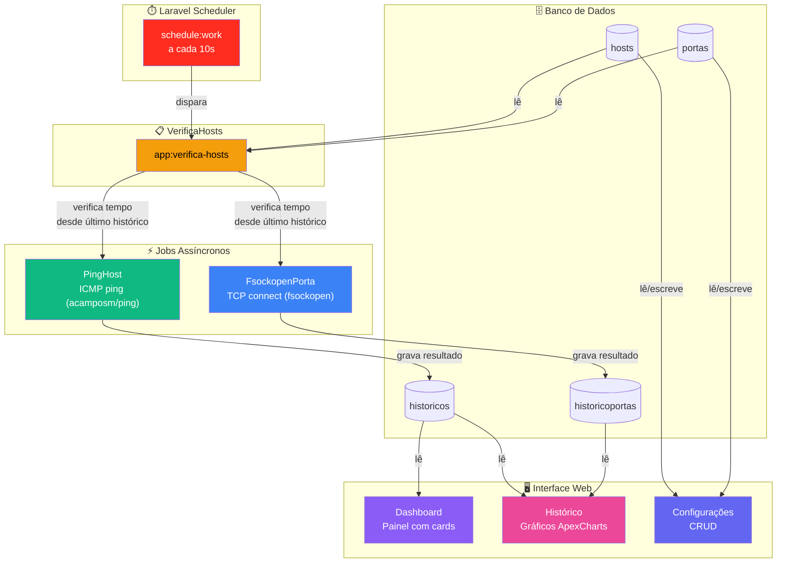

<p align="center">
  
  
  
  
  
  
</p>

<h1 align="center">🖥️ Monitoramento de Redes</h1>
<p align="center"><em>Sistema web de monitoramento de infraestrutura de rede — ping ICMP e verificação de portas TCP com dashboard em tempo real e gráficos históricos.</em></p>

---

## 📑 Índice

- [Sobre o Projeto](#-sobre-o-projeto)
- [Demonstração](#-demonstração)
- [Funcionalidades](#-funcionalidades)
- [Arquitetura](#-arquitetura)
- [Stack Tecnológica](#-stack-tecnológica)
- [Modelo de Dados](#-modelo-de-dados)
- [Pré-requisitos](#-pré-requisitos)
- [Instalação e Configuração](#-instalação-e-configuração)
- [Como Usar](#-como-usar)
- [Estrutura de Pastas](#-estrutura-de-pastas)
- [Roadmap](#-roadmap)
- [Licença](#-licença)
- [Contato](#-contato)

---

## 📖 Sobre o Projeto

**Monitoramento de Redes** é uma aplicação web desenvolvida em Laravel que permite monitorar a disponibilidade de servidores e serviços de rede de forma proativa. O sistema realiza verificações periódicas de conectividade via **ping ICMP** e **conexão TCP** em portas específicas, exibindo os resultados em um dashboard intuitivo com indicadores visuais de status.

> 📚 **Contexto pessoal**: Este é um projeto **antigo** — meu **primeiro projeto independente em Laravel**, construído inteiramente por conta própria, sem seguir tutoriais ou cursos online. Ele representa o ponto de partida da minha jornada com o framework e carrega o valor do aprendizado prático: desde a modelagem do banco de dados e a arquitetura de jobs assíncronos até a construção da interface com Blade e Tailwind. Decidi mantê-lo público como registro da minha evolução como desenvolvedor.
>
> Embora o código reflita escolhas de alguém que estava começando, o sistema é **totalmente funcional** e entrega valor real: monitoramento contínuo de infraestrutura de rede com thresholds configuráveis e dashboards visuais.

### Por que este projeto?

Em ambientes corporativos ou mesmo em infraestruturas pessoais, saber quando um servidor fica indisponível **antes que o usuário perceba** é essencial. Este sistema resolve esse problema com:

- **Monitoramento automatizado**: verificações em intervalos configuráveis por host e por porta
- **Thresholds personalizáveis**: limites de warning e critical para perda de pacotes e latência
- **Histórico completo**: gráficos de evolução temporal de latência, packet loss e status de portas
- **Processamento assíncrono**: jobs em fila database que não bloqueiam a interface do usuário

---

## 🎬 Demonstração

> **📸 Adicione suas capturas de tela na pasta `docs/screenshots/`**

### Sugestões de capturas:

| Tela | Descrição |
|------|-----------|
| **Painel (Dashboard)** | Cards coloridos com status dos hosts: 🟢 ATIVO / 🟡 WARNING / 🔴 PROBLEMA / 🔵 NÃO MONITORADO |
| **Histórico** | Gráficos ApexCharts de latência, packet loss e tabela cronológica de eventos |
| **Configurações** | Lista de hosts e portas cadastradas com ações de editar/excluir |
| **Cadastro de Host** | Formulário com thresholds configuráveis e seleção de portas |

```
docs/
└── screenshots/
    ├── painel.png
    ├── historico.png
    ├── configuracoes.png
    └── cadastro-host.png
```

> 💡 **Dica**: Grave um GIF curto da navegação com [ScreenToGif](https://www.screentogif.com/) (Windows) ou [Peek](https://github.com/phw/peek) (Linux) para tornar o portfólio ainda mais atrativo.

---

## ⚙️ Funcionalidades

### 🔍 Monitoramento

- ✅ **Ping ICMP** em hosts com 3 pacotes por verificação (configurável via `config/ping.php`)
- ✅ **Verificação de portas TCP** via `fsockopen()` com timeout de 5 segundos
- ✅ **Thresholds duplos** (warning e critical) para perda de pacotes (%) e latência (ms)
- ✅ Intervalo de verificação **configurável por host e por porta** (em minutos)
- ✅ Jobs assíncronos processados via **Laravel Queue** (database driver)

### 📊 Dashboard

- 🟢 **ATIVO** — host operando dentro dos thresholds normais
- 🟡 **WARNING** — host ultrapassou o limite de warning (atenção)
- 🔴 **PROBLEMA** — host ultrapassou o limite crítico ou está inacessível
- 🔵 **NÃO MONITORADO** — host cadastrado mas com monitoramento desativado
- ⚪ **SEM HISTÓRICO** — host recém-cadastrado, aguardando primeira verificação
- Filtro visual por status com contadores
- Campo de busca textual por nome do host

### 📈 Histórico por Host

- **Gráfico de latência** — tempo de resposta mínimo, máximo e médio (ms)
- **Gráfico de packet loss** — porcentagem de perda de pacotes ao longo do tempo
- **Gráfico de status de portas** — linha do tempo de cada porta associada
- **Estatísticas de uptime** — tempo total ativo / warning / problema (em horas)
- **Tabela cronológica** — registro completo de todas as verificações com data, status, packet loss e latência

### 👤 Autenticação e CRUD

- Sistema de **login e registro** de usuários
- **CRUD completo** de hosts (nome, IP, thresholds, portas associadas)
- **CRUD completo** de portas (nome, número, hosts associados)
- Associação **N:N** entre hosts e portas com intervalo individual por relacionamento
- **Soft deletes** com cascade em todos os modelos
- Interface responsiva com **Tailwind CSS 4**

---

## 🧩 Arquitetura

O fluxo de monitoramento segue o pipeline abaixo. O **Laravel Scheduler** é o coração do sistema, acionando o comando `app:verifica-hosts` a cada 10 segundos, que por sua vez decide se deve disparar novos jobs com base no tempo decorrido desde a última verificação.



### Classificação de status

O job `PingHost` classifica cada verificação seguindo a seguinte lógica:

| Condição | Status |
|----------|--------|
| Packet loss ≥ `perda_crt` **OU** latência média ≥ `tempo_crt` | 🔴 PROBLEMA |
| Packet loss ≥ `perda_wng` **OU** latência média ≥ `tempo_wng` | 🟡 WARNING |
| Nenhum threshold atingido | 🟢 ATIVO |
| Host inacessível (exceção no ping) | 🔴 PROBLEMA (100% loss) |

---

## 🛠️ Stack Tecnológica

| Camada | Tecnologia | Versão | Descrição |
|--------|-----------|--------|-----------|
| **Framework** | [Laravel](https://laravel.com) | 12.x | Framework PHP full-stack |
| **Linguagem** | PHP | 8.2+ | — |
| **Frontend** | Blade + [Tailwind CSS](https://tailwindcss.com) | 4.x | Templates server-side com utility-first CSS |
| **Build** | [Vite](https://vitejs.dev) | 6.x | Bundler de assets front-end |
| **Gráficos** | [ApexCharts](https://apexcharts.com) | CDN | Biblioteca de gráficos interativos em JS |
| **Ping ICMP** | [acamposm/ping](https://github.com/acamposm/ping) | 2.1 | Wrapper PHP para o comando `ping` do sistema |
| **Soft Cascade** | [askedio/laravel-soft-cascade](https://github.com/Askedio/laravel-soft-cascade) | 12.0 | Cascade de soft deletes nos relacionamentos |
| **Fila** | Laravel Queue (database) | — | Processamento assíncrono de jobs |
| **Banco de Dados** | MySQL / MariaDB / SQLite | — | Suporte a múltiplos SGBDs |
| **Testes** | PHPUnit | 11.x | Framework de testes |

### Pacotes PHP principais

```json
{
  "php": "^8.2",
  "laravel/framework": "^12.0",
  "acamposm/ping": "^2.1",
  "askedio/laravel-soft-cascade": "^12.0",
  "laravel/tinker": "^2.10.1"
}
```

---

## 🗃️ Modelo de Dados

```
┌──────────────────────────────────────────────────────┐
│                       hosts                          │
│  id, nome, ip, ativa, monitorar, perda_wng,          │
│  perda_crt, tempo_wng, tempo_crt, tempo, timestamps  │
└──────┬──────────────┬──────────────┬─────────────────┘
       │              │              │
       │ 1:N          │ N:M          │ N:M
       ▼              ▼              ▼
┌──────────────┐ ┌──────────────┐ ┌──────────────┐
│  historicos  │ │  host_porta  │ │  user_host   │
│  id, status, │ │  id, host_id,│ │  id, host_id,│
│  pk_loss,    │ │  porta_id,   │ │  user_id     │
│  tr_min,     │ │  tempo       │ └──────────────┘
│  tr_max,     │ └──────┬───────┘
│  tr_med,     │        │
│  host_id (FK)│        │ N:M
└──────────────┘        ▼
              ┌──────────────────────────┐
              │          portas          │
              │  id, nome, porta, ativa  │
              └────────────┬─────────────┘
                           │ 1:N
                           ▼
              ┌──────────────────────────┐
              │     historicoportas      │
              │  id, status, porta_id,   │
              │  host_id                 │
              └──────────────────────────┘
```

### Descrição das tabelas

| Tabela | Propósito |
|--------|-----------|
| `hosts` | Servidores/dispositivos monitorados — IP, nome, thresholds, intervalo de ping |
| `portas` | Serviços TCP cadastrados — nome amigável e número da porta |
| `host_porta` | **Pivot N:N** — associa host a porta com intervalo de verificação (`tempo`) |
| `historicos` | Resultados de ping — status, packet loss, latência (min/max/avg) |
| `historicoportas` | Resultados de verificação de porta — status booleano (aberta/fechada) |
| `user_host` | **Pivot N:N** — associação entre usuários e hosts |

> Todas as tabelas utilizam **soft deletes** e **timestamps** do Laravel.

---

## 📋 Pré-requisitos

| Requisito | Versão Mínima |
|-----------|---------------|
| PHP | 8.2+ |
| Composer | 2.x |
| Node.js + npm | 18+ |
| MySQL / MariaDB / SQLite | — |

### Extensões PHP necessárias

- `bcmath`, `ctype`, `fileinfo`, `json`, `mbstring`, `openssl`, `pdo`, `tokenizer`, `xml`

### Permissão para ping ICMP

O pacote `acamposm/ping` utiliza o comando `ping` do sistema operacional:

- **Linux**: conceda capability ao binário do PHP:
  ```bash
  sudo setcap cap_net_raw+ep $(which php)
  ```
- **Windows**: execute o terminal/servidor como **Administrador**

---

## 🚀 Instalação e Configuração

```bash
# 1. Clone o repositório
git clone https://github.com/seu-usuario/monitoramento-redes.git
cd monitoramento-redes

# 2. Instale as dependências PHP
composer install

# 3. Configure o ambiente
cp .env.example .env
php artisan key:generate

# 4. Edite o arquivo .env com suas credenciais de banco de dados
# DB_CONNECTION=mysql
# DB_HOST=127.0.0.1
# DB_PORT=3306
# DB_DATABASE=monitoramento_redes
# DB_USERNAME=root
# DB_PASSWORD=

# 5. Execute as migrations
php artisan migrate

# 6. Instale as dependências front-end e compile os assets
npm install
npm run build

# 7. Inicie o servidor de desenvolvimento
php artisan serve
```

### ⚡ Processamento em segundo plano

O sistema requer **dois processos** rodando em paralelo ao servidor web:

```bash
# Terminal 1 — Worker da fila (processa os jobs de ping e verificação de porta)
php artisan queue:work database

# Terminal 2 — Scheduler (dispara as verificações a cada 10 segundos)
php artisan schedule:work
```

> **Em produção**: configure o `schedule:run` no crontab do Linux e o `queue:work` como serviço (ex: Supervisor). Consulte a [documentação oficial do Laravel](https://laravel.com/docs/queues#running-the-queue-worker).

### Usando SQLite (desenvolvimento rápido)

```bash
# Crie o arquivo do banco e execute as migrations
touch database/database.sqlite
php artisan migrate
```

---

## 👣 Como Usar

### 1. Registre-se e faça login
Acesse `http://localhost:8000` e crie sua conta.

### 2. Cadastre as portas que deseja monitorar
Vá em **"adicionar porta"** e cadastre serviços como HTTP (80), HTTPS (443), SSH (22), MySQL (3306), etc. Associe-as aos hosts desejados.

### 3. Adicione hosts
Em **"adicionar host"**, preencha:
- **Nome** — identificação amigável (ex: "Servidor Web")
- **IP** — endereço do host
- **Tempo entre verificações** — intervalo em minutos
- **Thresholds de warning/critical** — perda de pacotes (%) e latência (ms)
- **Portas** — selecione as portas a monitorar neste host

### 4. Acompanhe o painel
A tela principal exibe cards coloridos com o status de cada host. Use os botões no topo para filtrar por status e o campo de busca para localizar hosts específicos.

### 5. Analise o histórico
Clique em **"Histórico"** no card de qualquer host para visualizar gráficos detalhados de latência, packet loss e disponibilidade de portas, além das estatísticas de uptime.

---

## 📁 Estrutura de Pastas

```
monitoramento-redes/
├── app/
│   ├── Console/Commands/
│   │   └── VerificaHosts.php          # 🔄 Comando do scheduler
│   ├── Http/Controllers/
│   │   ├── HostController.php         # CRUD de hosts + dashboard
│   │   ├── PortaController.php        # CRUD de portas
│   │   └── UserController.php         # Autenticação
│   ├── Jobs/
│   │   ├── PingHost.php               # ⚡ Job de ping ICMP
│   │   └── FsockopenPorta.php        # ⚡ Job de verificação TCP
│   └── Models/
│       ├── Host.php                   # Model de hosts (N:N com portas e users)
│       ├── Porta.php                  # Model de portas
│       ├── Historico.php              # Histórico de ping
│       ├── Historicoportas.php        # Histórico de verificação de portas
│       └── User.php                   # Usuário autenticado
├── config/
│   └── ping.php                       # Configuração do pacote acamposm/ping
├── database/migrations/               # Schema do banco de dados
├── resources/views/site/              # Templates Blade
│   ├── painel.blade.php               # Dashboard principal
│   ├── historico.blade.php            # Gráficos e tabela de histórico
│   ├── adicionar.blade.php            # Formulário de cadastro de host
│   ├── editar.blade.php               # Formulário de edição de host
│   ├── configuracoes.blade.php        # Lista de hosts e portas
│   ├── porta.blade.php                # Formulário de cadastro de porta
│   ├── editar_porta.blade.php         # Formulário de edição de porta
│   ├── login.blade.php                # Tela de login
│   └── layout.blade.php              # Layout base com Tailwind + ApexCharts
├── routes/
│   ├── web.php                        # Rotas da aplicação
│   └── console.php                    # Agendamento do schedule
├── docs/
│   └── screenshots/                   # 📸 Capturas de tela
├── composer.json                      # Dependências PHP
├── package.json                       # Dependências front-end
└── vite.config.js                     # Configuração do Vite + Tailwind
```

---

## 🗺️ Roadmap

- [ ] **Notificações** — alertas por e-mail, Telegram ou webhook quando um host mudar de status
- [ ] **Monitoramento SNMP** — suporte a métricas via SNMP (tráfego, CPU, memória)
- [ ] **API REST** — endpoints para consulta externa dos status e históricos
- [ ] **Testes automatizados** — cobertura com PHPUnit (feature e unit)
- [ ] **Docker Compose** — ambiente de desenvolvimento containerizado
- [ ] **Modo escuro** — dark mode na interface
- [ ] **Exportação de relatórios** — PDF e CSV com dados históricos
- [ ] **RBAC** — controle de acesso por perfil (admin, viewer)
- [ ] **Dashboard de portas** — visão agregada da saúde de todas as portas

---

<p align="center">
  <sub>Feito com 💙 usando <a href="https://laravel.com">Laravel</a> • <a href="https://tailwindcss.com">Tailwind CSS</a> • <a href="https://apexcharts.com">ApexCharts</a></sub>
</p>
